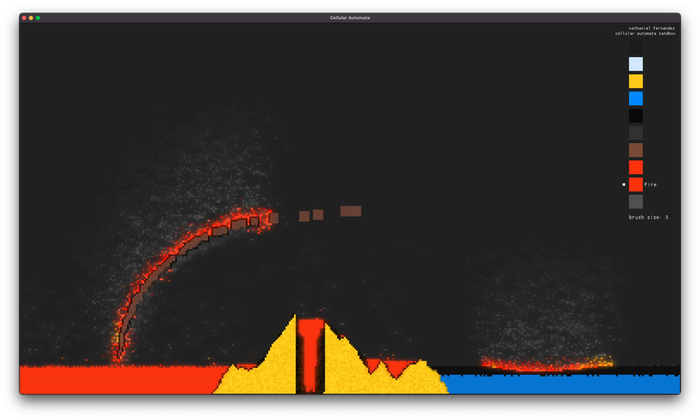

# Cellular Automata Sandbox Demo

### An interactive sandbox demonstrating cellular automata.

This project was heavily inspired by Noita and The Powder Toy.

Every cell on screen has a simple set of rules that it follows every game tick. This sandbox lets you place many different types of cells and observe their emergent behaviors.

    
    

        <b>You can try out this demo <a href="https://nathanielfernandes.github.io/cellular_automata">here</a></b>
    

 

## Cell Types and Behaviors:

- Falling Solids

  - Base Properties

    - affected by gravity and falls forming mounds (based on it's inertial resistance)

  - **Sand**
    - bad heat conductor
    - not affected by much
  - **Gun Powder**
    - good heat conductor
    - combusts instantly

- Liquids

  - Base Properties

    - affected by gravity and spreads to fill space
    - wets other cells

  - **Water**
    - good heat conductor
    - puts out fire and helps prevent fires
  - **Oil**
    - less dense and more viscous than water
    - highly flammable and makes other cells more flammable

- Gasses

  - Base Properties

    - rises and spreads to fill space

  - **Smoke**
    - less dense than air
    - great heat conductor
    - suffocates fire
    - can cause burns
  - **Fire**
    - needs air to stay alive
    - lights flammable cells on fire and heats up surrounding cells
    - spreads itself along flammable cells
    - great head conductor
  - **Air**
    - can conduct heat (currently disabled)

- Stationary Solids

  - Base Properties

    - not affected by gravity

  - **Wood**
    - is very flammable
    - can burn up
  - **Bedrock**
    - indestructible
  - **Stone**
    - currently indestructible

## Highlights

- cells that cannot move or are inactive will 'sleep' preventing them for being checked until they can move.
- uses a custom GLSL shader to create bloom for glowing cells.
- cells can transform between states (currently limited to only a few).
- simulates heat with conductivity and spread.
- the only bottle neck for the sandbox is drawing the cells.

## Next Steps

- increase performance by reducing the number of draw calls
- thread the simulation
- add more cells and rework the cell state transitions
- allow for creating custom cell types from within the sandbox
- better ui
